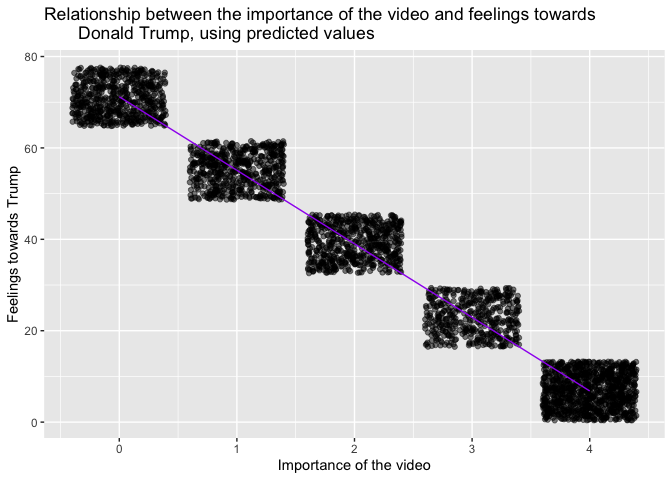
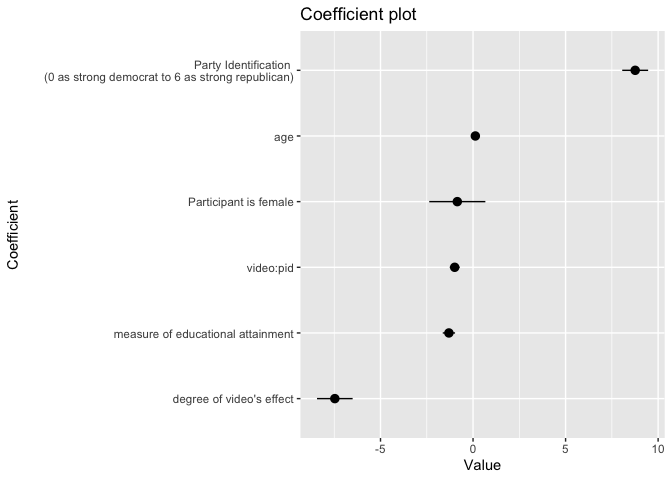
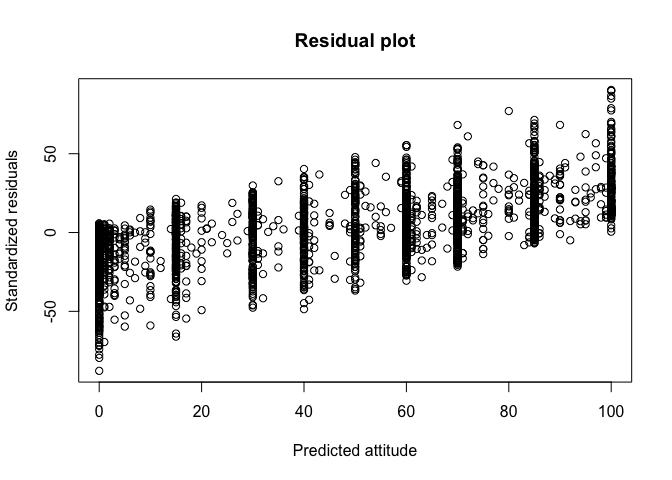

hw07 Part I
================
bohan yin
11/14/2019

## Estimate a basic (single variable) linear regression model of the relationship between the importance of the video and feelings towards Donald Trump.

The basic linear regression model of the relationship between the
importance of the video and feelings towards Donald Trump is expressed
as:

  - Attitudes = β0 + β1video

Here is the result of the regression model. As we can see, the p.value
is zero, meaning that the video variable is very significant in
influncing feelings towards Trump in this basic model.

    ## # A tibble: 2 x 5
    ##   term        estimate std.error statistic p.value
    ##   <chr>          <dbl>     <dbl>     <dbl>   <dbl>
    ## 1 (Intercept)     71.2     0.779      91.4       0
    ## 2 video          -16.1     0.295     -54.6       0

Here is a visualized result. From the graph we can see that as
importance of the video drops, the feelings towards Trump rises.

<!-- -->

If we want to see the predictive power of this model, here is a more
intuitive visualization.

<!-- -->   From the
graph, we can see that the feelings and importance of the video are
clustered in different rectangles. Each rectangle represents different
set of combinations of the range of feelings and range of video
importance. For example, the second rectangle starting from the left
shows that people who rate importance of the video as 1 feel warmth
toward Trump ranging from 50 to 60. In addition, the fifth rectangel
starting from the left seems the darkest, meaning that this cluster has
the most people who think video is very important and don’t like
Trump.

## Estimate a linear regression model of attitudes towards Donald Trump given the variables you have available.

The linear regression model of attitudes towards Donald Trump given the
variables available is written as:  

  - Attitudes = β0 + β1video + β2female + β3pi + β4age + β5educ +
    β6video\*pid  

Notice that I added interaction term: video\*pid, as there might be some
joint effects of both attitude toward video and party identification.
The table below shows the result of the model:

    ## # A tibble: 7 x 5
    ##   term        estimate std.error statistic   p.value
    ##   <chr>          <dbl>     <dbl>     <dbl>     <dbl>
    ## 1 (Intercept)   39.7      2.52       15.7  9.99e- 54
    ## 2 video         -7.47     0.491     -15.2  1.38e- 50
    ## 3 female        -0.851    0.773      -1.10 2.71e-  1
    ## 4 pid            8.76     0.357      24.5  3.97e-122
    ## 5 age            0.124    0.0221      5.62 2.08e-  8
    ## 6 educ          -1.30     0.170      -7.69 1.97e- 14
    ## 7 video:pid     -0.992    0.136      -7.29 3.90e- 13

    ## 
    ## % Table created by stargazer v.5.2.2 by Marek Hlavac, Harvard University. E-mail: hlavac at fas.harvard.edu
    ## % Date and time: Tue, Nov 19, 2019 - 02:12:28
    ## \begin{table}[!htbp] \centering 
    ##   \caption{Table 1: Regression Results Importance of the Video and Feelings towards Trump} 
    ##   \label{} 
    ## \begin{tabular}{@{\extracolsep{5pt}}lc} 
    ## \\[-1.8ex]\hline 
    ## \hline \\[-1.8ex] 
    ##  & \multicolumn{1}{c}{\textit{Dependent variable:}} \\ 
    ## \cline{2-2} 
    ## \\[-1.8ex] & Feelings towards Trump \\ 
    ## \hline \\[-1.8ex] 
    ##  Importance of the video & $-$7.468$^{***}$ \\ 
    ##   & (0.491) \\ 
    ##   & \\ 
    ##  female & $-$0.851 \\ 
    ##   & (0.773) \\ 
    ##   & \\ 
    ##  pid & 8.761$^{***}$ \\ 
    ##   & (0.357) \\ 
    ##   & \\ 
    ##  age & 0.124$^{***}$ \\ 
    ##   & (0.022) \\ 
    ##   & \\ 
    ##  educ & $-$1.304$^{***}$ \\ 
    ##   & (0.170) \\ 
    ##   & \\ 
    ##  video:pid & $-$0.992$^{***}$ \\ 
    ##   & (0.136) \\ 
    ##   & \\ 
    ##  Constant & 39.656$^{***}$ \\ 
    ##   & (2.522) \\ 
    ##   & \\ 
    ## \hline \\[-1.8ex] 
    ## Observations & 3,231 \\ 
    ## R$^{2}$ & 0.612 \\ 
    ## Adjusted R$^{2}$ & 0.612 \\ 
    ## Residual Std. Error & 21.739 (df = 3224) \\ 
    ## F Statistic & 849.054$^{***}$ (df = 6; 3224) \\ 
    ## \hline 
    ## \hline \\[-1.8ex] 
    ## \textit{Note:}  & \multicolumn{1}{r}{$^{*}$p$<$0.1; $^{**}$p$<$0.05; $^{***}$p$<$0.01} \\ 
    ## \end{tabular} 
    ## \end{table}

From the table, we can see that besides female variable, the p-value for
all other variables are smaller than 0.05, meaning they are significant
in impacting the attitude towards Trump, and we will ignore the effect
of female as it is not significant. Specifically, when we talk about
participants’ attitudes toward Trump in terms of feeling thermometer
rating:

  - For every unit increase in video response, the attitude drops
    roughly 7.5 on the rating.
  - For every unit increase in party identification, or becomeing more
    republican, the attitude rises roughly 8.8 on the rating.
  - For every unit increase in age, the attitude slightly rises 0.1 on
    the rating.
  - For every unit increase in education, the attitude drops roughly 1.3
    on the rating.

## Coefficient plot

If we want to check the result in an intuitive manner, here is the
coefficient plot that contains coefficients of variables on affecting
the attitude:

<!-- -->

Same as the analysis stated previously, this plot offers a more
intuitive result. As we can see, the increase in party identification
positively affects the attitude toward Trump, meaning that the more
republican you are, the more favor you have on Trump; the increase in
degree of video’s effect negatively affects the attitude toward Trump,
meaning that the more important you think the video is, the less favor
you have on Trump.    

## Evaluation

We can also do a simple evaluation of this model. As we can see from the
summary below, the R-squared is 0.6124219, which means that the model
explains 61.24% variations of the dependent variable (in this case, the
attitude towards Trump).

    ## 
    ## Call:
    ## lm(formula = trump ~ video + female + pid + age + educ + video:pid, 
    ##     data = trump_data)
    ## 
    ## Residuals:
    ##     Min      1Q  Median      3Q     Max 
    ## -87.761 -12.479  -1.229  12.462  90.452 
    ## 
    ## Coefficients:
    ##             Estimate Std. Error t value Pr(>|t|)    
    ## (Intercept) 39.65621    2.52225  15.723  < 2e-16 ***
    ## video       -7.46834    0.49062 -15.222  < 2e-16 ***
    ## female      -0.85054    0.77316  -1.100    0.271    
    ## pid          8.76085    0.35691  24.547  < 2e-16 ***
    ## age          0.12409    0.02208   5.619 2.08e-08 ***
    ## educ        -1.30442    0.16967  -7.688 1.97e-14 ***
    ## video:pid   -0.99202    0.13609  -7.289 3.90e-13 ***
    ## ---
    ## Signif. codes:  0 '***' 0.001 '**' 0.01 '*' 0.05 '.' 0.1 ' ' 1
    ## 
    ## Residual standard error: 21.74 on 3224 degrees of freedom
    ## Multiple R-squared:  0.6124, Adjusted R-squared:  0.6117 
    ## F-statistic: 849.1 on 6 and 3224 DF,  p-value: < 2.2e-16

  Here is the residual plot for the model, which only has
symmetrical distribution when predicted attitude is around 50. And
residuals do not really clustered around the lower single digits of the
y-axis. This means tht this model still has a huge room of improvement.

<!-- -->

  
